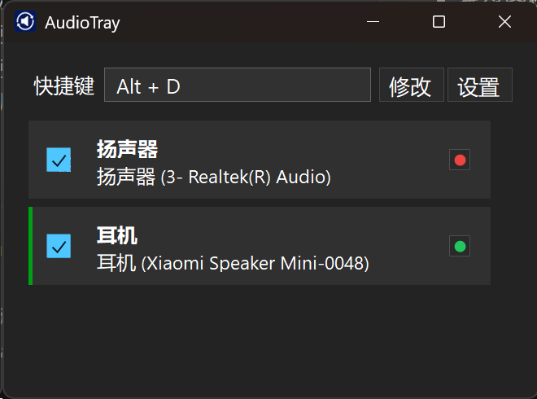
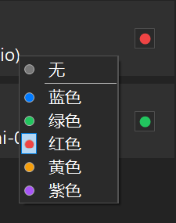

# AudioTray

AudioTray 是一个 Windows 托盘音频设备切换工具。

下载 Release 里的 `AudioTray.exe`，双击打开即可使用。

## 界面预览

主界面：



托盘图标：


颜色选择：



## 功能

- 查看当前默认声音输出设备
- 勾选需要参与快捷切换的播放设备
- 给不同播放设备设置颜色标记
- 使用快捷键在已勾选设备之间快速切换
- 自定义切换快捷键
- 托盘图标显示当前音量；静音时显示空心圆
- 托盘图标右下角显示当前设备的颜色标记
- 支持深色 / 浅色模式
- 支持开机自动启动

## 基本操作

1. 双击 `AudioTray.exe` 启动程序。
2. 双击系统托盘里的 AudioTray 图标打开主界面。
3. 勾选要参与切换的播放设备。
4. 点击设备右侧颜色按钮，为设备选择颜色。
5. 点击“修改”可以自定义切换快捷键。
6. 点击“设置”可以切换深色模式或开启开机自动启动。

## 配置文件

程序会在 `AudioTray.exe` 同目录自动生成配置文件：

```text
audiotray.config.xml
```

这个文件用于保存快捷键、设备选择、颜色标记、主题和开机启动等设置。一般不需要手动修改。

## 退出程序

右键系统托盘里的 AudioTray 图标，选择“退出”。
